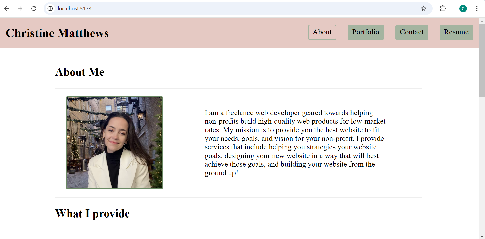
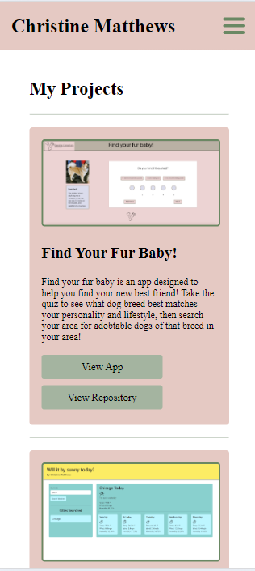

# Portfolio

## Table of Contents
- [Description](#description)
- [Installation](#installation)
- [Usage](#usage)
- [Licenses](#licenses)
- [Contributors](#contributors)
- [Testing](#testing)
- [Contact](#contact-info-for-questions)

## Description
This application is a personal portfolio designed to display my skills in react as well as mobile-first design.

## Installation
n/a

## Usage
To use this app, navigate through navigation to view my projects, resume, and bio as well as fill out the form to request a consultation.

## Licenses
#### MIT License
The MIT License is an older license used to provide copyright protection.

## Contributors
Christine Matthews (Andreola)

## Testing
n/a

## Contact info for Questions
#### Github: 
<a href="https://github.com/cmatthews3212">cmatthews3212</a>

#### Email: 
<a href="mailto: matthews.christinemarie@gmail.com">matthews.christinemarie@gmail.com</a>

## Screenshots

## Website Link
https://cmatthews-portfolio.netlify.app/
